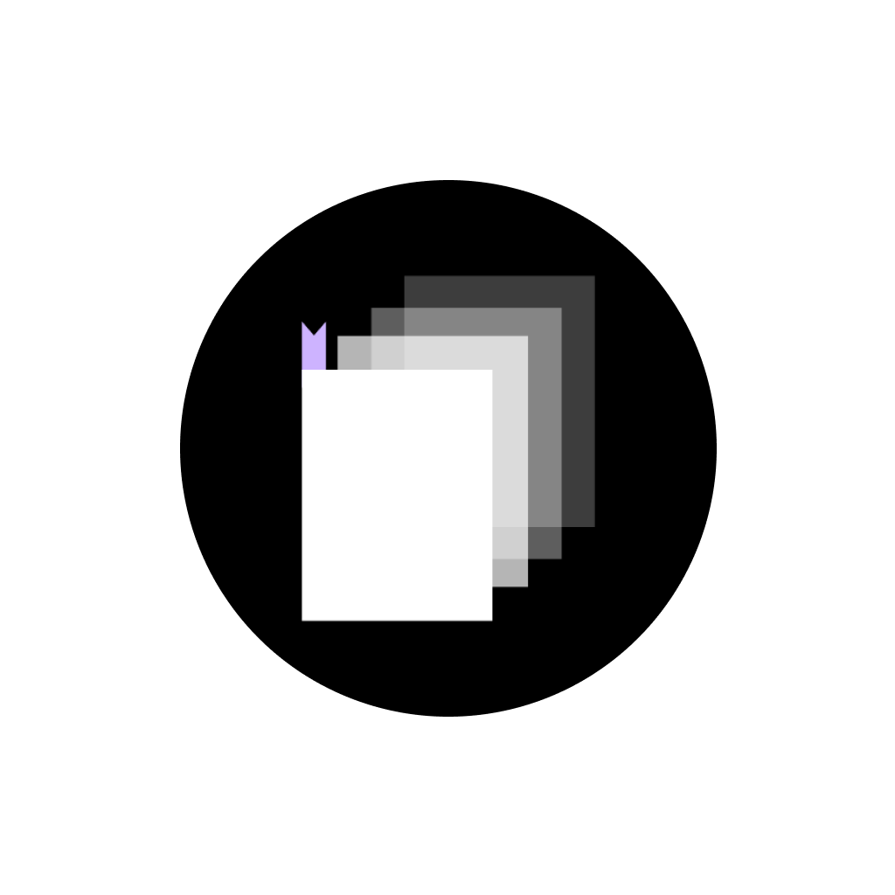

# BookmarkIt

This app is made for track a thing that have URL that you want to explore later. It can be used for other purposes since it’s just an app that tracks items and URLs of what you created. If you click on an item, it will go to the website that you saved.

## Features
- Bookmark a thing with URL you want to track
- Import / export list of created items for transferring data

## Why made this app

Originally, because Japanese publisher manga websites have many different sites (like 4–5 websites), I wanted to group them into one app and make it easy for me to track the manga that I’m following. So this app is made for bookmarking manga that I want to read.
And this app is made for learning TypeScript and to make me more comfortable with React Native. 

## Made by

This app is made with React Native + Expo with TypeScript and JavaScript.
